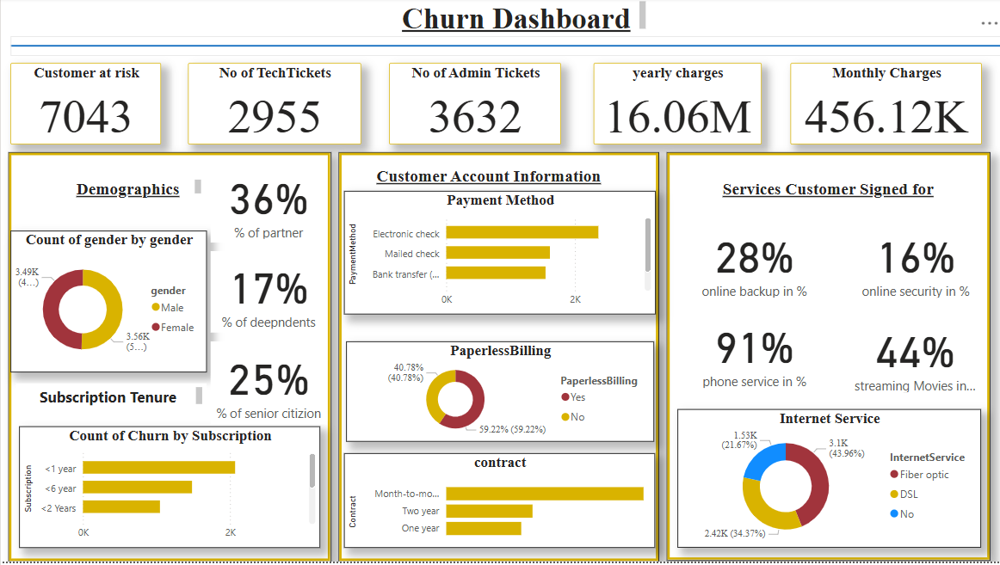

# 📊 Customer Churn Analysis Dashboard — Power BI Project

Welcome! This repository contains my **Customer Churn Analysis** dashboard built using **Power BI**.  
The goal of this project is to analyze customer churn trends and help businesses understand why customers leave, so they can make better decisions to improve customer retention.

---

## 🌟 Project Highlights

- Visualizes key metrics such as **churn rate**, **active vs. churned customers**, and **revenue impact**.
- Shows customer segments by **region**, **demographics**, or other important categories.
- Helps identify patterns and areas where a company can take action to reduce churn.

---

## ⚙️ Tools Used

- **Power BI Desktop** for building the dashboard.
- Original dataset in **CSV/Excel** format (exported from the Power BI file).

---

## 📁 What’s Inside This Repo

- `CCA.pbix` — The main Power BI dashboard file.
- `data/` — Folder containing the exported dataset.
- `images/` — Folder with screenshots of the dashboard visuals.
- `README.md` — This project documentation.

---

## 🔍 Dashboard Preview

Below is a quick look at the dashboard.  

## Overwive Pgae

## Chrun Dashboard

## Customer Risk Analysis report

---

## 🚀 How to Open & Explore

1. Download the `.pbix` file from this repository.
2. Open it with **Power BI Desktop**.
3. If needed, refresh the dataset.
4. Explore the visuals, filters, and insights!

---

## 📄 License & Notes

This project is for learning and demo purposes only.  
Please do not use or share any sensitive data.

---

Thanks for checking out my project! ⭐ If you find this useful, feel free to connect with me or explore my other work on [GitHub](https://github.com/your-username).

